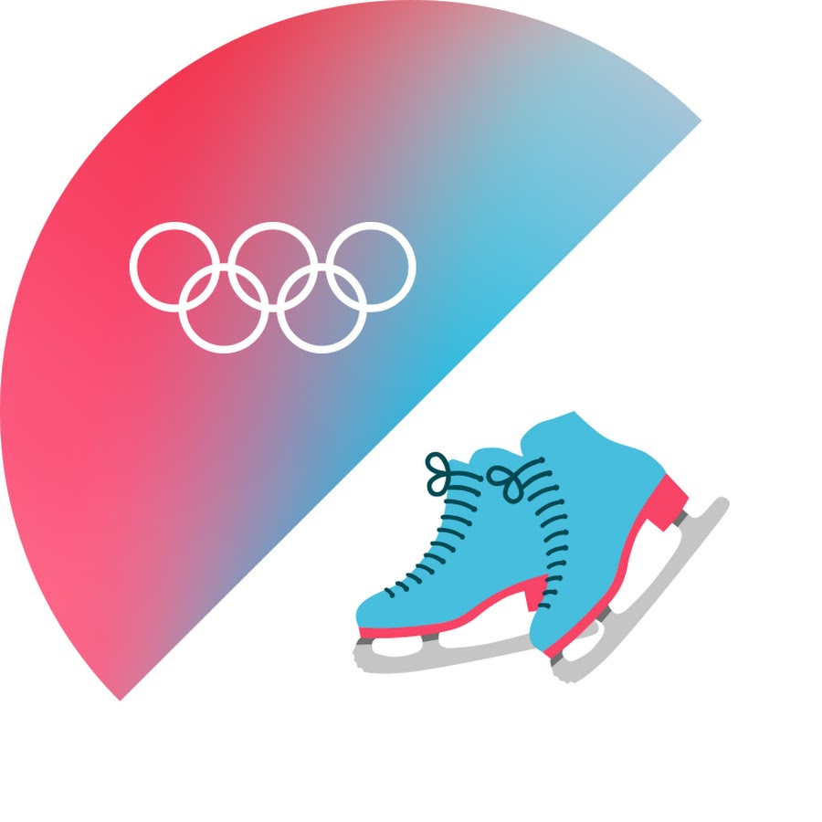

The International Skating Union (ISU) is the international governing body
for competitive ice skating disciplines, including figure skating,
synchronized skating, speed skating, and short track speed skating.

Since the Olympic Games are held once every four years, isu are held as the main competition every year.

It was founded in Scheveningen, Netherlands, in July 1892,
making it one of the oldest international sport federations.
The ISU was formed to establish standardized international
rules and regulations for the skating disciplines it governs,
and to organize international competitions in these disciplines.
It is now based in Switzerland.

Membership

Andorra,
Argentina,
Armenia,
Azerbaijan,
Australia,
Belgium,
Bosnia and Herzegovina,
Brazil,
Bulgaria,
Chile,
China,
Chinese Taipei,
Denmark,
Germany,
Estonia,
Finland,
France,
Georgia,
Greece,
Hong Kong,
India,
ndonesia,
Ireland,
Iceland,
Israel,
Italy,
Japan,
Cambodia,
Canada,
Kazakhstan,
Qatar,
Kyrgyzstan,
Colombia,
North Korea,
South Korea,
Croatia,
Latvia,
Liechtenstein,
Lithuania,
Luxembourg,
Malaysia,
Mexico,
Moldova,
Monaco,
Mongolia,
Morocco,
New Zealand,
Netherlands,
North Macedonia,
Norway,
Austria,
Peru,
Philippines,
Poland,
Romania,
Russia,
Sweden,
Switzerland,
Serbia,
Singapore,
Slovakia,
Spain,
South Africa,
Thailand,
Czech Republic,
Turkey,
Ukraine,
Hungary,
Uzbekistan,
United Arab Emirates,
United States,
Great Britain,
Vietnam,
Belarus,
Cyprus,

