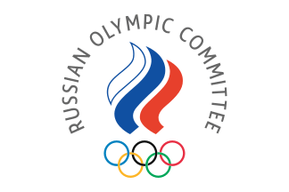
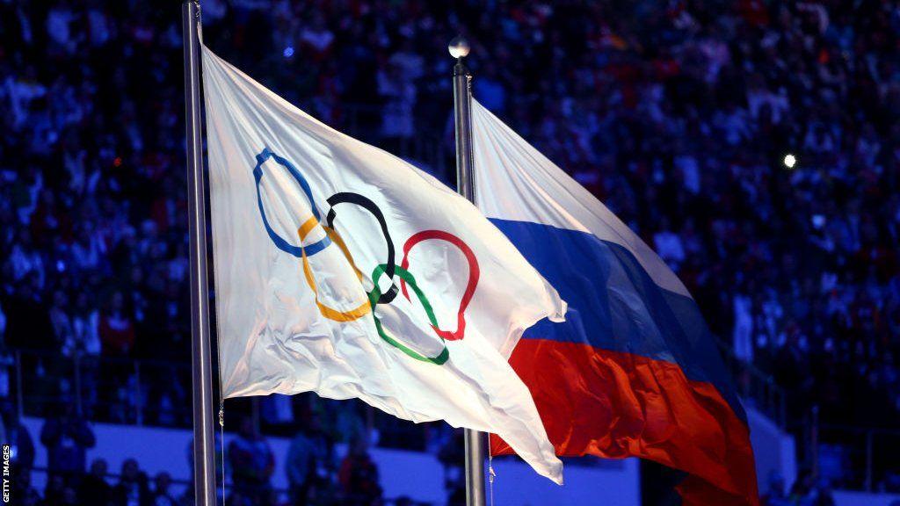
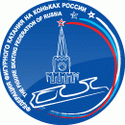

The Russian Olympic Committee (ROC) is the National
Olympic Committee representing Russia.
On 12 October 2023, the International Olympic Committee (IOC) suspended
the membership of the Russian Olympic Committee.

The Figure Skating Federation of Russia 
is the national sport governing body for figure skating in Russia.
It is recognized as such by the Russian Olympic Committee (ROC) and
the International Skating Union (ISU). No individual membership exists,
and its members are part of various regional ice sports associations.
It was founded in 1992 as the successor of the Figure Skating Federation
of the USSR (Soviet Union).

The goals of this governing body are: taking a plan of competitions by the calendar,
developing a curriculum for figure skating in Russia,
forming a national team, making contracts with sportsmen
and coaches, international relations with other skating organizations,
assistance to regional federations, organizing the Rostelecom Cup (formerly the Cup of Russia)
and other important events. Since 2009, the main sponsor of the federation is Rostelecom.

After the 2022 Russian invasion of Ukraine,
the ISU suspended the participation of athletes from
Russia in international events until further notice.

COMPETITIONS

Annual Russian Championships

Rostelecom Cup

Russian Junior Championships

Russian Cup (national championship selections)

Belgorod Oblast Open Championships with A. Mishin prizes (in Belgorod)

Nikolai Panin Memorial (St. Petersburg)

Northern Lights (Arkhangelsk)

Samarochka (Samara)

Silver Skates (Tomsk)

Zhuk Memorial

Siberia and the Far East Open Championships

